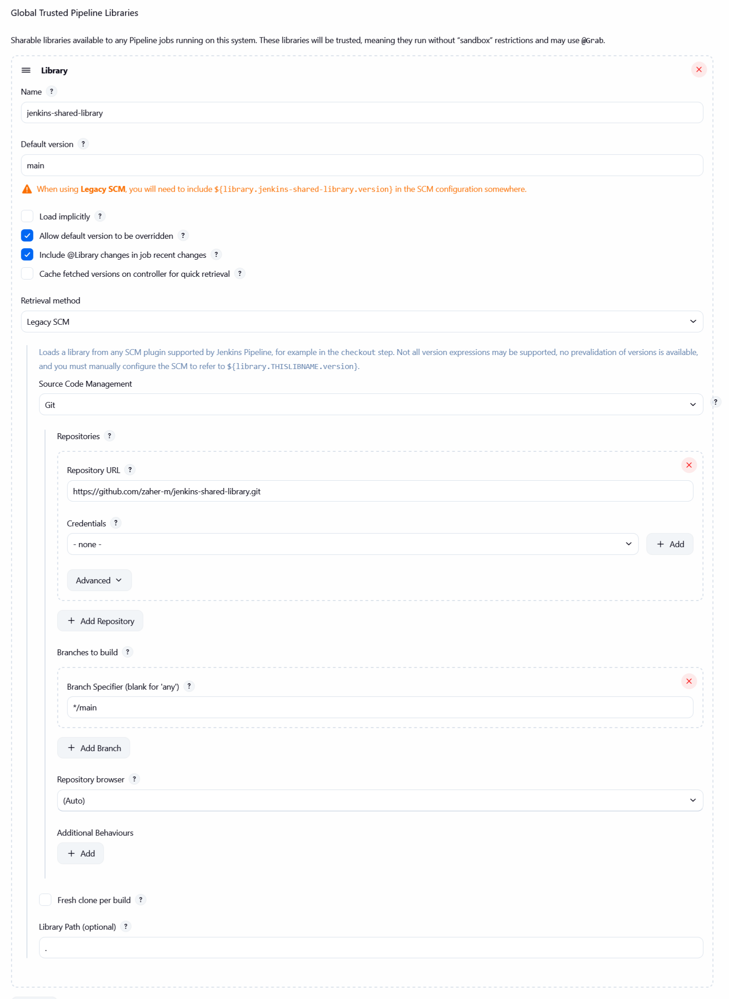
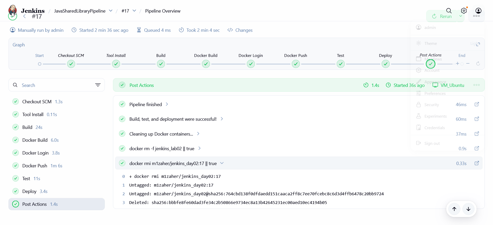
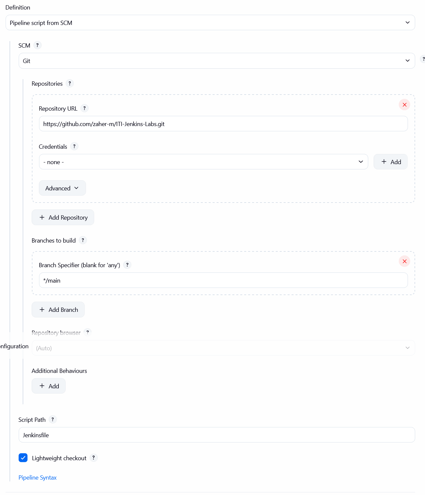
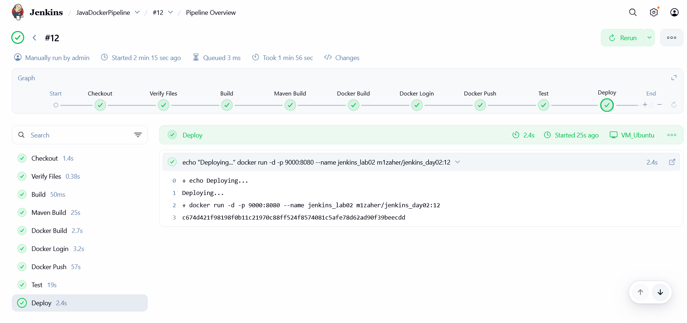

# ITI Jenkins Labs

This repository contains a Spring Boot application that serves as a demonstration for CI/CD pipelines using Jenkins. Built as part of ITI's Jenkins course.

## Features

- Integrated with Jenkins for automated build, test, and deployment.
- Includes both declarative and scripted Jenkins pipelines.
- Uses Docker to containerize the application for easy deployment.

## CI/CD Pipelines

This project includes two types of Jenkins pipelines: a declarative pipeline (`Jenkinsfile`) and a scripted pipeline (`JenkinsfileScripted`). Both pipelines automate the process of building, testing, and deploying the application.

### Declarative Pipeline (`Jenkinsfile`)

The declarative pipeline is defined in the `Jenkinsfile` and uses a more structured, opinionated syntax. It leverages a shared library (`jenkins-shared-library`) to reuse code and maintain a cleaner pipeline definition.

**Pipeline Stages:**

1.  **Build**: Compiles the application using Maven. It also includes a check to ensure the build number is greater than or equal to 5.
2.  **Docker Build**: Builds a Docker image of the application.
3.  **Docker Login**: Logs in to Docker Hub using stored credentials.
4.  **Docker Push**: Pushes the Docker image to Docker Hub.
5.  **Test**: Runs the application's tests using Maven.
6.  **Deploy**: Deploys the application as a Docker container.

**Pipeline Configuration:**

**Successful Build:**

### Scripted Pipeline (`JenkinsfileScripted`)

The scripted pipeline, defined in `JenkinsfileScripted`, uses Groovy syntax and provides more flexibility and control over the pipeline's execution.

**Pipeline Stages:**

1.  **Checkout**: Checks out the source code from the repository.
2.  **Verify Files**: Lists the files in the workspace.
3.  **Build**: Checks the build number.
4.  **Maven Build**: Compiles the application and packages it as a `.jar` file.
5.  **Docker Build**: Builds a Docker image.
6.  **Docker Login**: Logs in to Docker Hub.
7.  **Docker Push**: Pushes the Docker image to Docker Hub.
8.  **Test**: Runs the application's tests.
9.  **Deploy**: Deploys the application as a Docker container.

**Pipeline Configuration:**

**Successful Build:**

